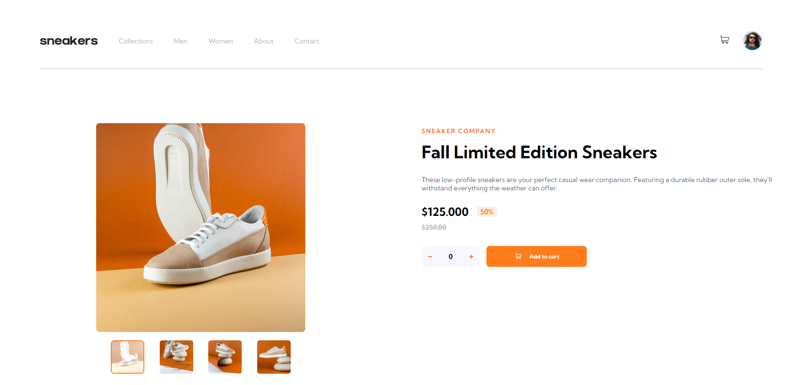
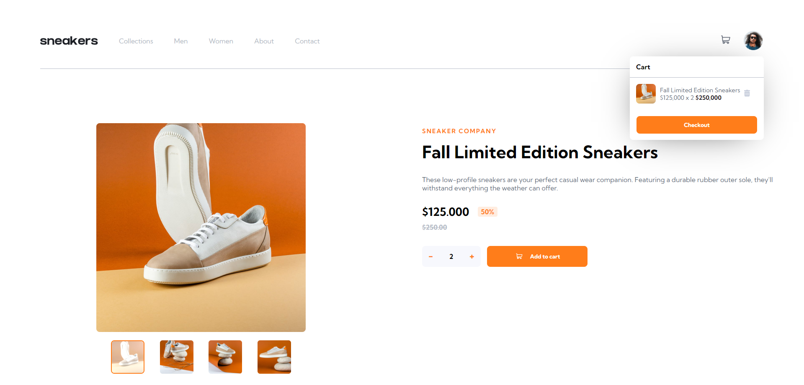
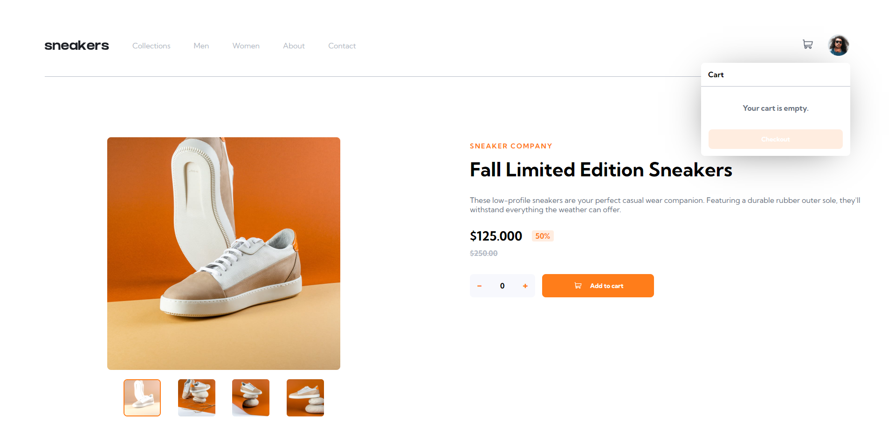
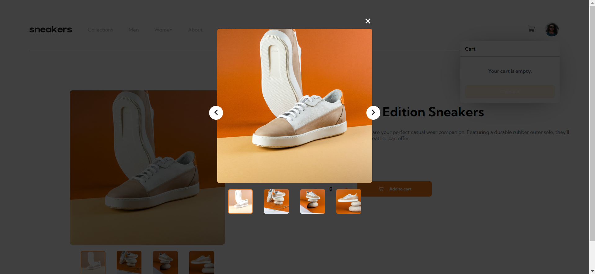
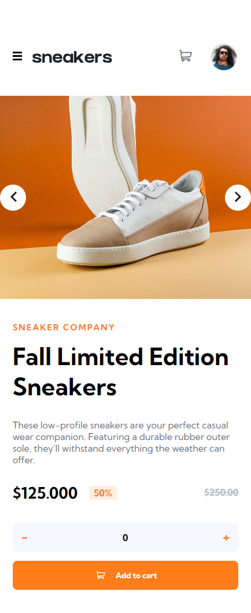

# Frontend Mentor - E-commerce product page solution

This is a solution to the [E-commerce product page challenge on Frontend Mentor](https://www.frontendmentor.io/challenges/ecommerce-product-page-UPsZ9MJp6). Frontend Mentor challenges help you improve your coding skills by building realistic projects.

### The challenge

Users should be able to:

- View the optimal layout for the site depending on their device's screen size
- See hover states for all interactive elements on the page
- Open a lightbox gallery by clicking on the large product image
- Switch the large product image by clicking on the small thumbnail images
- Add items to the cart
- View the cart and remove items from it

### Screenshot

### Links

- Solution URL: [here](https://github.com/jhonatansoto45/ecommerce-product-page)
- Live Site URL: [here](https://ecommerce-product-page-flame.vercel.app/e-commerce/home)

### Built with

- Semantic HTML5 markup
- CSS custom properties
- Flexbox
- CSS Grid
- Mobile-first workflow
- [Angular](https://angular.io/) - JS Framework

### Continued development

I want to continue learning ux/ui on mobile devices. global status of a frontend application and design patterns to give robustness to a multi access system.

## Author

- Frontend Mentor - [@jhonatansoto45](https://www.frontendmentor.io/profile/jhonatansoto45)
- Twitter - [@Bautistajhonata](https://www.twitter.com/Bautistajhonata)

